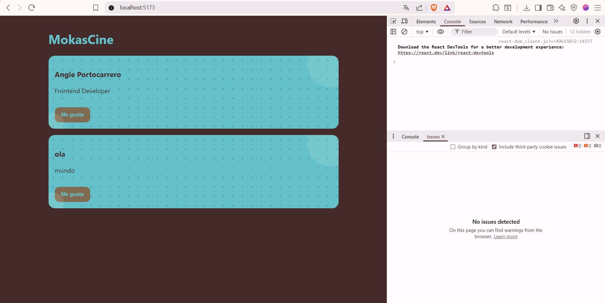
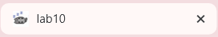
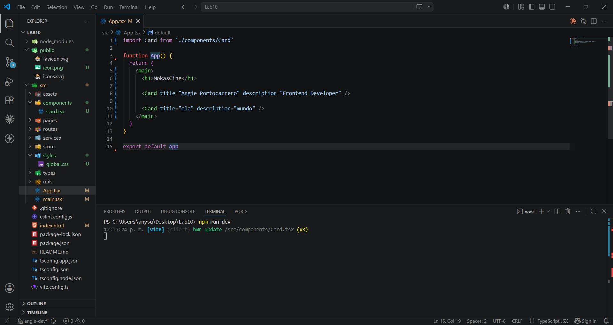
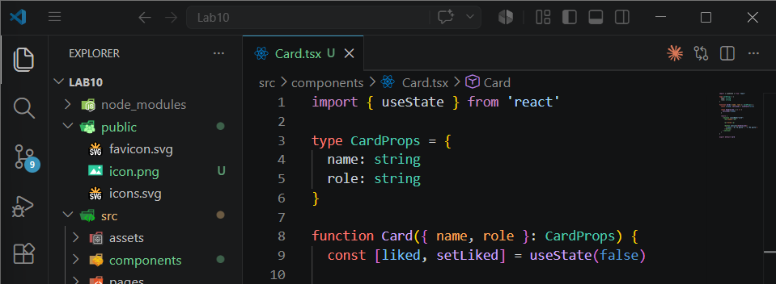
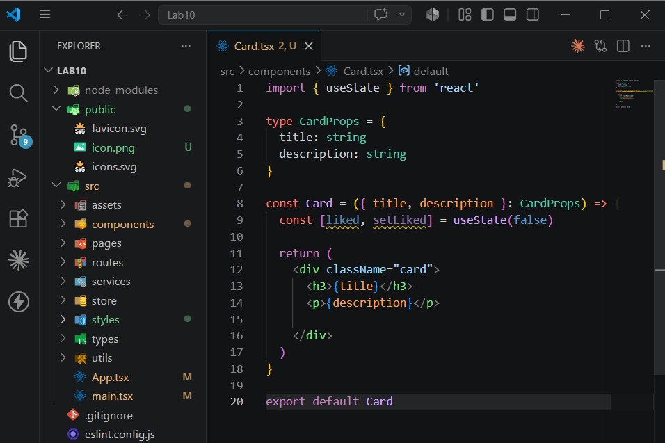
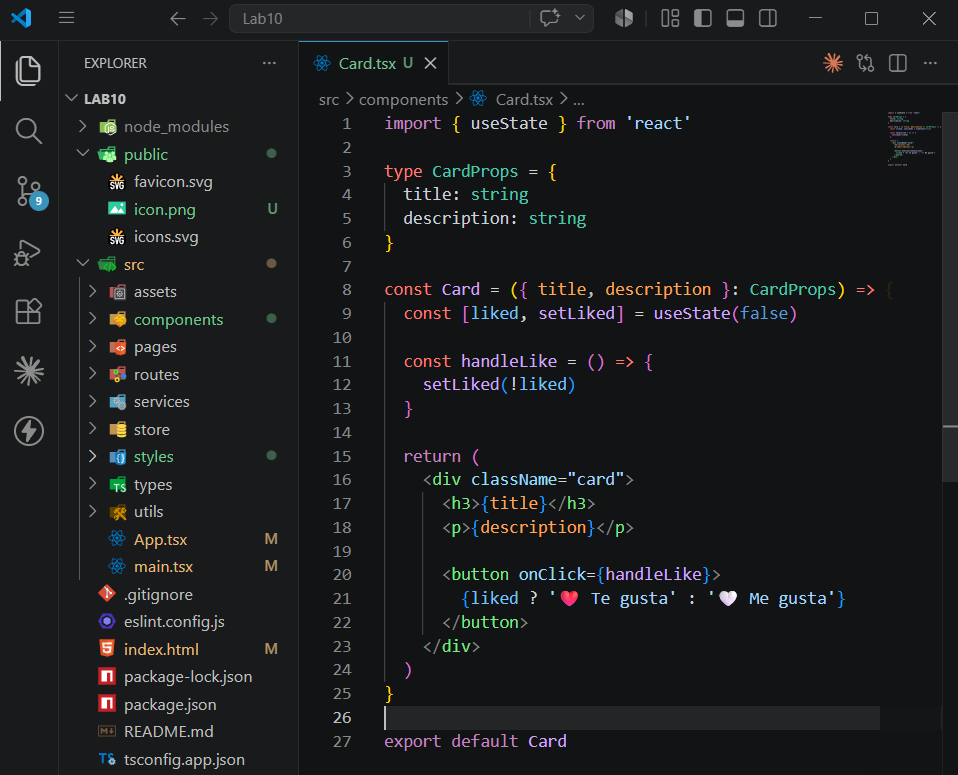

# ⋆｡˚🌿 Proyecto CineSpoilerS 🌿˚｡⋆

---

## ˚₊· ͟͟͞͞➳❥ Aplicación desarrollada con React + TypeScript + Vite

CineSpoilerS es una aplicación desarrollada para practicar la creación y comunicación de componentes en React utilizando props, estados y eventos.

El proyecto mantiene una estructura limpia y organizada, además de una interfaz minimalista inspirada en colores menta y chocolate.

---

# Tecnologías utilizadas

- React
- TypeScript
- Vite
- CSS3

---

# Estructura del proyecto

```bash
src
│
├── components
│   └── Card.tsx
│
├── pages
├── routes
├── services
├── store
├── styles
│   └── global.css
│
├── types
├── utils
│
├── App.tsx
└── main.tsx
```

---

# Pasos para ejecutar el proyecto

### 1. Clonar el repositorio

```bash
git clone https://github.com/anngiepp/Lab10.git
```

### 2. Ingresar al proyecto

```bash
cd Lab10
```

### 3. Cambiar a la rama de desarrollo

```bash
git checkout angie-dev
```

### 4. Instalar dependencias

```bash
npm install
```

### 5. Ejecutar el proyecto

```bash
npm run dev
```

---

# Evidencias

## Evidencia 1 - Proyecto funcionando correctamente y sin errores




---

## Evidencia 2 - Estructura limpia del proyecto



---

## Evidencia 3 - Uso de props en componentes



---

## Evidencia 4 - Estado en el componente



---

## Evidencia 5 - Manejo de estado mediante eventos



---

# Conclusión

Se logró desarrollar correctamente una aplicación básica en React utilizando componentes reutilizables, props, estados y eventos. Además, se mantuvo una estructura organizada y una interfaz visual minimalista con temática inspirada en tonos menta.